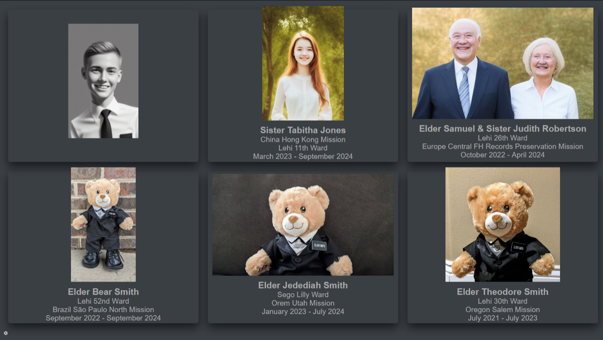

# Called

A digital missionary board/slideshow.

It can be used in conjunction with a Raspberry Pi (or similar) and connected to
a television screen to create a kiosk.

The board is a web application that can be deployed wherever makes sense, which
is then accessed from the kiosk machine.

## Deployment

Previous incarnations of this application idea ran entirely on the Raspberry Pi,
but that was awkward because it was deployed in a network that I couldn't
control, and wasn't accessible remotely to manage the displayed missionaries.
Yes, there are things like ssh tunnels that could be used, but I didn't feel
entirely comfortable deploying such things on a network administered by people
that I don't know and don't have the ability to easily contact. As a result, the
expected deployment is on a publicly accessible web server with the kiosk
running only a browser pointed at the server.

## Technologies

- Web app framework: [Django](https://www.djangoproject.com/)
- Static file serving: [WhiteNose](https://whitenoise.readthedocs.io/en/stable/index.html)
- UI CSS: [DaisyUI](https://daisyui.com)
